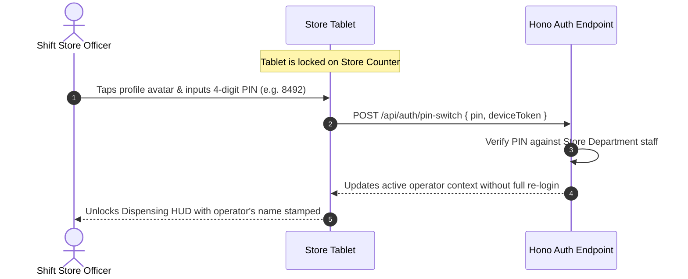

# Moh Foods NG - Enterprise Operations Platform (MOH-OPS)
# Product Requirements Document (PRD) & Technical Specification

**Version:** 1.0.0  
**Target Enterprise:** Moh Industries Ltd / Moh Foods NG ([mohfood.com](https://mohfood.com))  
**NAFDAC Reg. No:** A8-106771 (Yogurt Parfait)  
**Author:** IT & Systems Architecture Department  
**Scope:** MVP (Admin, Executive Management, Inventory Store) + Modular Domain Foundation for Enterprise Scaling  

---

## 1. Executive Summary & Strategic Context

Moh Foods NG is an established FMCG food manufacturing and distribution company based in Lagos and Ogun State, Nigeria. The company specializes in freshly crafted dairy and healthy treat lines:
- **Moh Yogurt Parfait** (NAFDAC Reg. No: A8-106771): Fresh yogurt layered with fresh fruits (apples, grapes, coconut), crunchy granola, raisins, and cashew nuts.
- **Moh Greek Yogurt**: Plain unsweetened, sweetened, and vanilla infused.
- **Moh Vanilla Yogurt Drink & Pure Coconut Oil**.

### The Problem
Moh Foods currently manages its manufacturing, warehouse inventory, supermarket distribution, and financial reconciliations using manual notebooks, disjointed spreadsheets, and WhatsApp communication threads. This causes:
1. **Inventory Discrepancy & Spoilage**: Material intake occurs on an irregular schedule, and ingredient dispensing to morning and night production shifts is tracked on paper, resulting in unrecorded stock shrinkages and unverified shift handovers.
2. **Untracked Production Returns**: Ingredients returned due to factory faults or excess dispensing are poorly documented, causing recipe calculation errors and stock drift.
3. **Consignment / Sale or Return (SoR) Debt Traps**: Products are supplied to retail supermarkets, grocery stores, and gym stockists on a **Sale or Return (SoR)** basis. Reconciling delivered goods against returned unsold stock and collecting cash is fraught with delay and human error.
4. **WhatsApp Invoice Confusion**: Delivery receipts, driver waybills, and payment confirmations are shared across WhatsApp groups without a centralized verification ledger.

### The Solution: MOH-OPS
A unified, modular, mobile-first Progressive Web App (PWA) built specifically for factory floor and executive operations:
- **Factory-Hardened Inventory Store Module**: Handles ad-hoc raw material inbounds, lot expiry tracking, decimal-precision measured dispensing (kg, cups), integer numbered counting (pieces, packs), packaging reconciliation, dual-shift morning/night handovers, and bi-directional returns (fault replacements vs excess restocks).
- **Executive Management Command Center**: Real-time SoR consignment ledger for retail stockists across Lagos & Ogun, WhatsApp invoice/waybill verification hub, procurement par-level alerts, and cross-departmental oversight.
- **Modular Domain Architecture**: Built on Next.js 16.3 (Bun runtime) + Hono API + NeonDB (PostgreSQL) + Cloudflare R2 with strict domain isolation so subsequent departments (Production, Logistics, Accounting, Merchandisers, Cleaners, Procurement, Media) plug in without rewriting core systems.

---

## 2. Brand Identity & UI Design System

The visual design system directly mirrors Moh Foods' branding extracted from the physical corporate roll-up banner and official web properties:

### 2.1 Color Palette & Design Tokens

```css
:root {
  /* Primary Brand: Berry Pink / Magenta (Energy, Taste, Vitality) */
  --brand-berry-primary: #D81B60;       /* Banner main magenta body */
  --brand-berry-dark: #AD1457;          /* Deep berry for hover & active states */
  --brand-berry-light: #FCE4EC;         /* Light berry tint for soft badges / highlights */
  --brand-berry-glow: rgba(216, 27, 96, 0.15);

  /* Secondary Brand: Fresh Avocado & Nature Green (Freshness, Health, NAFDAC Quality) */
  --brand-lime-swoosh: #84BD00;         /* Banner top wave lime */
  --brand-green-fresh: #7CB342;         /* Accent leaf green */
  --brand-green-forest: #008153;        /* Web button green & dark ribbon divider */
  --brand-green-light: #E8F5E9;         /* Green tint for verified / in-stock badges */

  /* Tertiary Accent: Warm Mango & Coral Peach (Parfait Fruit Accent) */
  --brand-peach: #FF9065;               /* Website warm highlight */
  --brand-mango: #FFA726;               /* Pending & warning highlights */

  /* Dark Neutrals: Cocoa Plum & Charcoal Slate (Readability & Professionalism) */
  --brand-dark-plum: #2B1B24;           /* Banner text "Moh Food" deep chocolate plum */
  --neutral-charcoal: #1E293B;          /* Primary body typography (Slate 800) */
  --neutral-slate: #475569;             /* Secondary labels & timestamps (Slate 600) */
  --neutral-border: #E2E8F0;            /* Crisp factory UI dividers (Slate 200) */

  /* Light Neutrals: Cream Yogurt & Clean Canvas (Sanitary & Wholesome) */
  --brand-cream: #FFFDF9;               /* Banner logo circle off-white cream */
  --surface-ground: #F8FAFC;            /* Clean app background (Slate 50) */
  --surface-card: #FFFFFF;              /* Pure white elevated cards */

  /* Semantic Feedback Tokens */
  --status-success: #059669;            /* Restocked, Paid, Reconciled, Verified */
  --status-warning: #D97706;            /* Low stock alert, Pending shift sign-off */
  --status-danger: #DC2626;             /* Faulty return, Expired item, Unpaid debt */
  --status-info: #2563EB;               /* Active shift, Inbound scheduled */
}
```

### 2.2 Typography & Readability Hierarchy
- **Display Headings**: `Poppins` / `Plus Jakarta Sans` (Semi-bold, rounded, modern food-industry aesthetic).
- **Body & Tabular Data**: `Inter` (Optimized for numerical clarity, high legibility on 10-inch store room tablets under bright fluorescent warehouse lighting).
- **Code & Barcode Labels**: `JetBrains Mono` / `Roboto Mono` for Batch IDs, Lot Numbers, and NAFDAC registration references.

### 2.3 Ergonomics for Factory Floor (PWA UX)
- **Minimum Touch Targets**: All buttons, quick-dispense selectors, and shift toggles have a minimum touch area of **48x48px** to allow comfortable interaction with gloved hands.
- **High-Contrast Dark Mode / Glare Mode**: High-contrast mode for warehouse workers operating under variable lighting conditions.
- **Audio & Haptic Feedback**: Optional sound and vibration chirp upon successful barcode scan or batch sign-off to minimize screen distraction.

### 2.4 Enterprise Layout Architecture: Left Immovable Sidebar & Content Pane
- **Left Immovable Sidebar (`Sidebar.tsx`)**:
  - Permanently fixed on the left viewport edge (`sticky top-0 h-screen w-64 lg:w-72 bg-white border-r border-slate-200 z-30 select-none`).
  - Does not scroll with the right-side content pane, maintaining instant access to navigation and emergency tablet lock.
  - Hosts the Moh Foods logo, NAFDAC Registration (`A8-106771`), plant status indicator, active shift switcher (Morning/Night), modular navigation categories, and pinned user profile with instant PIN lock.
  - Touch-friendly sliding drawer with backdrop overlay for mobile/tablet screen viewports.
- **Right Content Viewport (`TopHeader.tsx` + `{children}`)**:
  - Uncluttered top bar containing breadcrumb trails, shift badge, facility status, and terminal lock shortcut.
  - Dedicated full-width content canvas with responsive padding and unified footer.

---

## 3. Technology Stack & Infrastructure

| Layer | Selected Technology | Technical Rationale |
|---|---|---|
| **Runtime & Package Manager** | **Bun 1.2+** | Ultra-fast script execution, instant package resolution, native TypeScript support, and lowest memory footprint. |
| **Frontend Framework** | **Next.js 16.3 (App Router)** | Modern React Server Components (RSC) for zero client bundle bloat on initial load, streaming SSR, and Next.js Server Actions. |
| **API Framework** | **Hono API (`@hono/node-server`)** | High-performance, lightweight web framework mounted at `/api`. Delivers end-to-end typed RPC (`hc`), Zod payload validation, and sub-millisecond route handling. |
| **Database & Engine** | **NeonDB (Serverless PostgreSQL)** | Fully managed serverless Postgres with instant branching (for zero-risk staging migrations), auto-scaling, and pooled WebSocket connections. |
| **ORM & Migrations** | **Drizzle ORM + Drizzle Kit** | Zero-overhead, edge-compatible, type-safe SQL builder with explicit schema control and automated migrations. |
| **Object Storage** | **Cloudflare R2** | S3-compatible, zero-egress fee cloud storage for delivery waybills, WhatsApp invoice photos, product packaging artwork, and batch quality proofs. |
| **PWA & Offline Worker** | **@serwist/next** | Successor to `next-pwa`, provides native service worker registration, offline fallback, stale-while-revalidate asset caching, and web app installability. |
| **Authentication & RBAC** | **Custom Iron Session / Signed JWT Cookies** | Secure HTTP-only cookies with Argon2id password hashing, multi-tenant department scoping, role-based capability lists, and quick PIN-based shift unlock for floor tablets. |
| **Barcode & Camera Engine** | **@zxing/browser + html5-qrcode** | Client-side camera-based scanning of QR codes and 1D barcodes (EAN-13, Code 128) for inventory items and delivery waybills without external hardware. |
| **Styling & Components** | **Tailwind CSS v4 + Radix UI / Lucide Icons** | Utility-first styling customized with Moh Foods design tokens, headless accessible primitives, and consistent iconography. |

---

## 4. End-to-End System Flows

### 4.1 Authentication & Department Gateway Flow
```mermaid
sequenceDiagram
    autonumber
    actor User as Staff / Executive
    participant Client as PWA Frontend
    participant AuthAPI as Hono Auth Endpoint
    participant DB as NeonDB (PostgreSQL)

    User->>Client: Enters Staff ID / Email + Password
    Client->>AuthAPI: POST /api/auth/login { identifier, password }
    AuthAPI->>DB: Query user, roles, permissions, assigned department
    DB-->>AuthAPI: User record + hashed credentials
    AuthAPI->>AuthAPI: Verify Argon2id hash & generate signed session cookie
    AuthAPI-->>Client: 200 OK (Set-Cookie: moh_session, payload: user profile)
    Client->>Client: Evaluate assigned role & active shift status
    alt Role == 'SUPER_ADMIN' or 'EXECUTIVE'
        Client-->>User: Redirect to /management/dashboard
    alt Role == 'STORE_MANAGER' or 'STORE_OFFICER'
        Client-->>User: Redirect to /inventory/dashboard (Prompt for Shift Selection: Morning/Night)
    else Other Department (Future: Production, Logistics, etc.)
        Client-->>User: Redirect to /department/[id]/dashboard
    end
```

### 4.2 Floor Tablet Fast PIN Switch Flow (Shared Device in Store Room)


---

## 5. Detailed Operational Specifications (MVP Roles)

### 5.1 Department: Inventory & Store Operations

#### 5.1.1 Raw Material Intake (Inbound Flow)
- **Arrival Frequency**: Ad-hoc / Occasional (suppliers arrive unannounced or on short notice).
- **Required Metadata**:
  - Supplier Name & Contact
  - Goods Received Note (GRN) Reference
  - Delivery Waybill / Invoice Snapshot (Uploaded directly to Cloudflare R2)
  - Arrival Date & Time
  - Receiving Officer Name
- **Quality Inspection Checklist**: Packaging integrity, visual freshness, smell/temperature check, manufacturing & expiry dates.

#### 5.1.2 Material Classification & Measurement Logic

Moh Foods operates with three distinct material handling paradigms:

| Category | Sub-Classification | Items Handled | Unit of Measurement (UoM) | Storage Precision |
|---|---|---|---|---|
| **Perishable** | **Measured Products** | Fresh Milk, Powdered Milk, Sugar, Oats, Granola, Raisins, Vanilla extract | `kg` (Kilograms), `g` (Grams), `cups` (Standardized Cups), `liters` | `numeric(12, 3)` (Allows exact 0.250kg or 1.500L tracking) |
| **Perishable** | **Numbered Products** | Fresh Apples, Seedless Grapes, Whole Coconuts, Cashew nuts (pre-packed/counted) | `count` (Pieces/Nuts), `bunches`, `packs` | `integer` (Exact discrete counts) |
| **Non-Perishable** | **Packaging Goods** | Parfait cups, Parfait dome covers, Greek yogurt containers, Vanilla drink bottles, Bottle caps, Aluminium foil rolls, Tamper-proof heat shrink seals, Front/back labels | `units` (Pieces), `sleeves` (e.g., 50 cups/sleeve), `cartons` | `integer` (Units & full packaging packs) |

#### 5.1.3 Daily Batch Dispensing (Outbound to Production Floor)
- **Shift Schedule**:
  - **Morning Shift**: 06:00 - 14:30
  - **Night Shift**: 18:00 - 02:30
- **Dispensing Protocol**:
  1. Production Supervisor submits a Requisition Batch: e.g., *"Produce 300 units of 400ml Moh Parfait + 150 units of 500ml Greek Yogurt"*.
  2. System auto-calculates Bill of Materials (BOM) guidance:
     - Milk: 45.000 kg
     - Granola: 12.500 kg
     - Apples: 75 pieces
     - Grapes: 300 pieces
     - Parfait Cups & Covers: 300 sets
     - Tamper-proof seals: 300 units
  3. Store Officer weighs/counts out materials, logs actual dispensed quantities, and assigns Lot IDs.
  4. Both Store Officer and Production Supervisor confirm transfer via digital acknowledgment.

#### 5.1.4 Bi-Directional Returns & Replacements
- **Scenario A: Fault Return & Immediate Replacement**
  - *Trigger*: Production encounters defective packaging (cracked parfait cups, torn foil) or spoiled ingredient.
  - *Action*: Production brings back the defective items to the store room.
  - *System Workflow*: Store logs `RETURN_FAULT`, records reason (e.g., "Factory defective seam"), issues an immediate replacement (`REPLACE_DISPENSE`), and flags items for supplier credit or scrap disposal write-off.
- **Scenario B: Excess Return & Restock**
  - *Trigger*: Production finishes the run and has unused ingredients (e.g., 2.500 kg unused oats, 15 unused apples, 20 unused cups).
  - *Action*: Items are inspected by Store Officer for hygiene and temperature.
  - *System Workflow*: Store logs `RETURN_EXCESS_RESTOCK`. Stock balance is immediately incremented with restocked timestamp and operator audit stamp.

#### 5.1.5 Shift Closing Inventory Count & Reconciliation
- At the close of each shift (Morning and Night), the Store Officer performs a physical count of top high-velocity items and compares against the system balance.
- **Variance Metric**: $\text{Variance} = \text{Physical Count} - \text{Expected System Balance}$.
- Any variance exceeding acceptable tolerance triggers a mandatory note (e.g. "Spillage during dispensing", "Moisture evaporation").
- Shift handover report is digitally locked and archived.

---

### 5.2 Department: Executive & Management Operations

#### 5.2.1 Supermarket & Retail Consignment (Sale or Return - SoR) Ledger
Moh Foods supplies retail supermarkets and stockists across Lagos & Ogun State on a **Sale or Return** agreement:
- **Consignment Tracking Equation**:
  $$\text{Net Sold} = \text{Delivered Quantity} - \text{Returned Expired Quantity}$$
  $$\text{Invoice Due} = \text{Net Sold} \times \text{Agreed Unit Price}$$
  $$\text{Outstanding Balance} = \text{Invoice Due} - \text{Cash / Transfer Paid}$$
- **Features**:
  - Retail Partner Profiles: Supermarket name, branch address, store manager name, direct WhatsApp/phone link, credit limit, delivery schedule.
  - Consignment Waybill generator with QR tracking.
  - Returned Goods Verification: Log expired parfaits retrieved from stores to credit partner accounts.
  - Aged Debtors Aging Report: 0-7 days, 8-14 days, 15-30 days, 30+ days overdue.

#### 5.2.2 WhatsApp Invoice & Delivery Reconciliation Center
- **The Challenge**: Logistics drivers drop goods at supermarkets and post delivery notes in a WhatsApp group; accounting receives bank alerts; procurement posts raw material receipts.
- **The Feature**:
  - Executive Upload Drop-Zone: Upload WhatsApp screenshot or photo of waybill/invoice.
  - Metadata Tagging: Link invoice to Supplier or Retail Partner, input invoice number, total amount, and delivery date.
  - Cloudflare R2 Archival: Secure, permanent storage with fast CDN thumbnail previews.
  - Reconciliation Status: `UNRECONCILED` $\rightarrow$ `MATCHED_TO_DELIVERY` $\rightarrow$ `PAYMENT_VERIFIED` $\rightarrow$ `ARCHIVED`.

#### 5.2.3 Raw Material Procurement & Par-Level Alerts
- Real-time stock level monitoring with dynamic reorder thresholds:
  - *Critical Red*: Stock covers $< 24$ hours of planned production.
  - *Warning Yellow*: Stock below safety buffer.
  - *Optimal Green*: Adequate inventory.
- One-Click Supplier Outreach: Pre-formatted WhatsApp message or phone call shortcut to suppliers for Milk, Cups, Honey, Oats, etc.

#### 5.2.4 Cross-Departmental Performance Hub
- Real-time snapshot of:
  - Total Raw Materials on Hand (valuation in NGN $\mathcal{N}$).
  - Current Daily Production Output vs Plant Capacity.
  - Total Active Consignment Debt with Supermarkets.
  - Weekly Spoilage & Fault Rate percentage.

#### 5.2.5 Executive Stock & Inventory Management Access
Executive Management (`EXECUTIVE` and `SUPER_ADMIN` roles) is granted full bidirectional operational control over factory store stock:
- **Full Route Access**: Executives can seamlessly navigate between `/management` (Executive Command Center) and `/inventory` (Store Inventory).
- **Catalog Management**: Add, modify, or archive raw materials, packaging supplies, pack sizes, reorder thresholds, and custom ingredient images.
- **Recipe Formulations (BOM)**: Construct, update, and manage dynamic Bill of Materials recipes for all finished goods lines.
- **Batch Dispensing Oversight**: Dispense ingredients to production shifts, adjust quantities, or omit specific items during batch allocation.
- **Shift Audits & Sign-offs**: Review inbound supplier deliveries, authorize fault replacements, and monitor dual-shift handovers.
- **Direct Executive Hub Links**: Immediate navigation from the Raw Stock Valuation KPI card and Plant Par Levels tab straight into Store Inventory.

---

## 6. Information Architecture & Modular Directory Structure

The platform uses a modular domain architecture within Next.js, allowing seamless expansion into future departments:

```
moh-ops/
├── apps/
│   └── web/
│       ├── public/
│       │   ├── icons/                 # PWA icons (192x192, 512x512, maskable)
│       │   ├── manifest.json          # PWA web manifest
│       │   └── branding/              # Moh Food logo & brand assets
│       ├── src/
│       │   ├── app/                   # Next.js App Router
│       │   │   ├── (auth)/            # Login & PIN unlock routes
│       │   │   ├── (dashboard)/
│       │   │   │   ├── inventory/     # Inventory & Store Department pages
│       │   │   │   │   ├── intake/    # Raw material inbound
│       │   │   │   │   ├── dispense/  # Morning & Night shift batch dispensing
│       │   │   │   │   ├── returns/   # Fault replacement & excess restock
│       │   │   │   │   ├── items/     # Catalog (measured, numbered, packaging)
│       │   │   │   │   └── shifts/    # Shift handovers & reconciliation
│       │   │   │   ├── management/    # Executive Management pages
│       │   │   │   │   ├── sor/       # Retail stockist SoR consignment ledger
│       │   │   │   │   ├── whatsapp/  # Invoice & waybill reconciliation
│       │   │   │   │   ├── suppliers/ # Procurement & supplier directory
│       │   │   │   │   └── analytics/ # Plant output & financial overview
│       │   │   │   └── admin/         # User roles, departments & audit logs
│       │   │   └── api/
│       │   │       └── [...route]/    # Hono API root handler
│       │   ├── modules/               # Domain-Driven Modular Business Logic
│       │   │   ├── auth/              # Auth controllers, hashing, session guards
│       │   │   ├── inventory/         # Stock transactions, shift reconciliations
│       │   │   ├── management/        # SoR ledger, executive metrics
│       │   │   ├── shared/            # Common domain utilities & R2 storage client
│       │   │   └── future_departments/# Extension stubs (Production, Logistics, Accounting...)
│       │   ├── server/                # Database & Backend Infrastructure
│       │   │   ├── db/
│       │   │   │   ├── schema/        # Drizzle ORM schema definitions
│       │   │   │   └── index.ts       # NeonDB pooled connection client
│       │   │   └── hono/              # Hono app instance, middlewares & routes
│       │   ├── components/            # UI Components
│       │   │   ├── ui/                # Moh Foods branded primitives (buttons, inputs)
│       │   │   ├── scanner/           # PWA camera barcode/QR scanner component
│       │   │   └── layout/            # Responsive sidebar, shift header, mobile nav
│       │   └── lib/                   # Utility helpers, formatters, date utils
│       ├── tailwind.config.ts         # Moh Foods color palette & design tokens
│       ├── next.config.ts             # Serwist PWA & image optimization settings
│       └── package.json
```

---

## 7. Complete Database Schema (Drizzle ORM & PostgreSQL)

```typescript
// Core Enums
export const departmentTypeEnum = pgEnum('department_type', [
  'EXECUTIVE_MANAGEMENT',
  'INVENTORY_STORE',
  'PRODUCTION',
  'LOGISTICS',
  'ACCOUNTING',
  'MEDIA',
  'CLEANERS',
  'MERCHANDISERS',
  'PROCUREMENT'
]);

export const userRoleEnum = pgEnum('user_role', [
  'SUPER_ADMIN',
  'EXECUTIVE',
  'STORE_MANAGER',
  'STORE_OFFICER',
  'PRODUCTION_SUPERVISOR',
  'LOGISTICS_OFFICER',
  'ACCOUNTANT',
  'STAFF'
]);

export const itemCategoryEnum = pgEnum('item_category', [
  'PERISHABLE_MEASURED',    // Milk, Sugar, Oats (kg, cups)
  'PERISHABLE_NUMBERED',    // Apples, Grapes, Coconut (count)
  'PACKAGING_NON_PERISHABLE'// Cups, Covers, Foil, Bottles, Labels
]);

export const shiftTypeEnum = pgEnum('shift_type', [
  'MORNING_SHIFT',
  'NIGHT_SHIFT'
]);

export const transactionTypeEnum = pgEnum('transaction_type', [
  'INBOUND_PURCHASE',       // Supplier delivery into store
  'DISPENSE_PRODUCTION',    // Dispensed for morning/night shift batch
  'RETURN_FAULT_REPLACE',   // Defective item returned & replaced
  'RETURN_EXCESS_RESTOCK',  // Unused ingredient returned from shift
  'DISPOSAL_EXPIRED_SPOILT',// Written off stock
  'RECONCILIATION_ADJUST'   // Physical count audit correction
]);

export const invoiceStatusEnum = pgEnum('invoice_status', [
  'PENDING_VERIFICATION',
  'MATCHED_TO_DELIVERY',
  'PAYMENT_RECONCILED',
  'DISPUTED'
]);
```

### Table Relationships:
- `users` $\rightarrow$ Belongs to a `department`, assigned a `user_role`, possesses a 4-digit `quick_pin`.
- `items` $\rightarrow$ Defines category, unit of measure (`kg`, `g`, `cup`, `unit`), current stock balance, minimum reorder threshold.
- `item_lots` $\rightarrow$ Tracks supplier batch number, arrival date, expiry date, and unit cost.
- `stock_transactions` $\rightarrow$ Append-only ledger recording every addition, deduction, fault, and restock with shift ID and operator stamp.
- `shifts` & `shift_reconciliations` $\rightarrow$ Logs opening balance, items dispensed, items returned, physical closing count, and discrepancies.
- `retail_partners` & `sor_consignments` $\rightarrow$ Tracks supermarket deliveries, returns of expired yogurt parfaits, and outstanding cash settlements.
- `whatsapp_invoices` $\rightarrow$ Stores Cloudflare R2 file URLs, tags, total amounts, and reconciliation status.
- `audit_logs` $\rightarrow$ Immutable audit trail of every administrative and financial event.

---

## 8. PWA, Offline & Hardware Integration

1. **Service Worker Caching**:
   - Cache-First strategy for static branding assets, icons, fonts, and CSS.
   - Network-First with IndexedDB fallback for item catalogs and active shift sheets.
2. **Offline Shift Count Queue**:
   - If the warehouse loses internet connection during shift closing, the count is stored locally in IndexedDB (`idb-keyval`).
   - As soon as network connectivity is restored, the queued reconciliation payload is synced to `/api/inventory/shifts/sync` with optimistic confirmation.
3. **Camera Barcode & QR Scanner**:
   - Integrated camera viewfinder scanning standard retail EAN-13 barcodes on packaging cartons and custom 2D QR codes on raw material lots.
   - Instant vibration and audio feedback on scan match.

---

## 9. Security & Access Control (RBAC) Matrix

| Operational Capability | Super Admin | Executive | Store Manager | Store Officer | Production Supervisor |
|---|:---:|:---:|:---:|:---:|:---:|
| View Executive KPI Command Center | ✅ | ✅ | ❌ | ❌ | ❌ |
| View / Edit Supermarket SoR Ledger | ✅ | ✅ | ❌ | ❌ | ❌ |
| Reconcile WhatsApp Invoices & Waybills | ✅ | ✅ | ❌ | ❌ | ❌ |
| Receive Raw Material Inbound (GRN) | ✅ | ✅ | ✅ | ✅ | ❌ |
| Dispense Shift Ingredients (Batch BOM) | ✅ | ❌ | ✅ | ✅ | ❌ |
| Acknowledge Received Shift Batch | ✅ | ❌ | ❌ | ❌ | ✅ |
| Log Fault Returns & Replacements | ✅ | ❌ | ✅ | ✅ | ✅ (Request) |
| Log Excess Returns (Restock) | ✅ | ❌ | ✅ | ✅ | ✅ (Request) |
| Submit Shift Closing Count | ✅ | ❌ | ✅ | ✅ | ❌ |
| Approve Stock Count Discrepancies | ✅ | ✅ | ✅ | ❌ | ❌ |
| User & Role Management | ✅ | ❌ | ❌ | ❌ | ❌ |

---

## 10. Operational Success Metrics (KPIs)

1. **Zero Unaccounted Inventory Variance**: Total unaccounted shift variance reduced to $< 0.5\%$ within 30 days of rollout.
2. **100% Shift Handover Compliance**: Digital Morning and Night shift sign-offs submitted with zero missing days.
3. **Accelerated SoR Collection**: Days Sales Outstanding (DSO) from retail supermarkets reduced by $40\%$ through automated expiry return credits and outstanding debt visibility.
4. **WhatsApp Invoice Zero Backlog**: Invoices reconciled within 24 hours of posting to WhatsApp.
