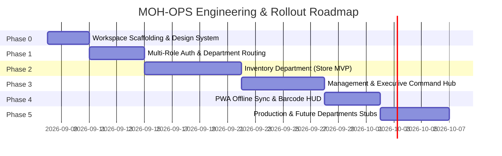

# Moh Foods NG - Enterprise Operations Platform (MOH-OPS)
# Phased Implementation Roadmap (Phases.md)

**Project Code:** MOH-OPS  
**Target Enterprise:** Moh Industries Ltd / Moh Foods NG ([mohfood.com](https://mohfood.com))  
**Tech Stack:** Next.js 16.3 (Bun Runtime) + Hono API + TSX + NeonDB (PostgreSQL) + Drizzle ORM + Cloudflare R2 + PWA (@serwist/next)  
**Methodology:** Incremental Agile Delivery (One verified module per phase)

---

## Phase Summary & Timeline

---

## Phase 0: Workspace Scaffolding, Core Infrastructure & Design System

### Objectives
Initialize the repository under Bun runtime, configure Next.js 16.3 App Router, mount Hono API, connect NeonDB via Drizzle ORM, configure Cloudflare R2 client, and establish the Moh Foods corporate design system tokens.

### Action Items
- [ ] Initialize Git repository with Conventional Commits setup.
- [ ] Initialize Bun project with Next.js 16.3, React 19, TypeScript 5.x.
- [ ] Configure Tailwind CSS v4 with Moh Foods brand tokens:
  - `--brand-berry-primary: #D81B60`
  - `--brand-lime-swoosh: #84BD00`
  - `--brand-green-forest: #008153`
  - `--brand-peach: #FF9065`
  - `--brand-dark-plum: #2B1B24`
  - `--brand-cream: #FFFDF9`
- [ ] Setup NeonDB pooled PostgreSQL connection and Drizzle ORM config (`drizzle.config.ts`, `schema.ts`).
- [ ] Setup Hono API root handler at `src/app/api/[...route]/route.ts` with type-safe RPC client export (`hc`).
- [ ] Setup Cloudflare R2 S3-compatible client (`@aws-sdk/client-s3`) with upload & signed URL helper.
- [ ] Setup PWA manifest (`manifest.json`), icons, and Serwist service worker scaffolding.

### Verification & Deliverables
- `bun run dev` boots Next.js with Hono `/api/health` returning 200 OK.
- `bun run db:generate` & `bun run db:push` cleanly connect to NeonDB.
- Design tokens verify visual accuracy against Moh Foods branding banner.

---

## Phase 1: Custom Multi-Role Authentication & Department Routing Engine

### Objectives
Build the department-aware, multi-role authentication system with Argon2id password hashing, HTTP-only signed session cookies, role capability guards, and the 4-digit fast PIN switcher for shared warehouse tablets.

### Action Items
- [ ] Implement Drizzle schemas: `departments`, `users`, `user_roles`, `sessions`, `quick_pins`.
- [ ] Seed initial departments: `EXECUTIVE_MANAGEMENT`, `INVENTORY_STORE`, `PRODUCTION`, `LOGISTICS`, `ACCOUNTING`, `MEDIA`, `CLEANERS`, `MERCHANDISERS`, `PROCUREMENT`.
- [ ] Seed initial roles: `SUPER_ADMIN`, `EXECUTIVE`, `STORE_MANAGER`, `STORE_OFFICER`, `PRODUCTION_SUPERVISOR`.
- [ ] Implement Hono Auth endpoints:
  - `POST /api/auth/login` (Staff ID / Email + Password)
  - `POST /api/auth/pin-switch` (Fast 4-digit PIN for store counter tablet)
  - `POST /api/auth/logout`
  - `GET /api/auth/me`
- [ ] Build Next.js Middleware for route protection and automatic department redirection:
  - `/management/*` $\rightarrow$ Accessible by `SUPER_ADMIN`, `EXECUTIVE`.
  - `/inventory/*` $\rightarrow$ Accessible by `SUPER_ADMIN`, `STORE_MANAGER`, `STORE_OFFICER`.
  - `/admin/*` $\rightarrow$ Accessible only by `SUPER_ADMIN`.
- [ ] Build Branded UI Pages:
  - `/login`: Moh Foods branded login card with yogurt parfait aesthetic.
  - `/lockscreen`: Shared tablet PIN pad with instant operator profile switching.

### Verification & Deliverables
- Unit tests for password hashing and PIN validation.
- Store officer login redirects to `/inventory/dashboard` with shift prompt.
- Executive login redirects to `/management/dashboard`.
- Unauthorized route access returns 403 Forbidden or redirects to login.

---

## Phase 2: Inventory Department Operations (Store Module MVP)

### Objectives
Implement the complete operational lifecycle of the Moh Foods store: raw material ad-hoc intake, item catalog (perishables measured/numbered & packaging), morning/night shift batch dispensing, bi-directional returns (faults & excess), and shift closing stock reconciliation.

### Action Items
- [ ] Implement Drizzle schemas:
  - `items` (categorized as `PERISHABLE_MEASURED`, `PERISHABLE_NUMBERED`, `PACKAGING_NON_PERISHABLE`).
  - `item_lots` (lot number, supplier, arrival date, expiry date, unit purchase cost).
  - `stock_transactions` (append-only ledger of every gram, piece, or carton movement).
  - `shifts` & `shift_reconciliations` (Morning and Night shift records, opening/closing balances).
- [ ] Item Catalog & Seed Data:
  - Measured perishables: Milk (kg), Sugar (kg), Oats (kg), Raisins (cups/kg), Granola (kg), Vanilla extract (L).
  - Numbered perishables: Apples (pcs), Grapes (pcs), Coconuts (nuts), Cashews (packs).
  - Packaging items: Parfait cups & lids, Greek yogurt containers, Vanilla bottles & caps, Foil rolls, Tamper-proof seals, Labels.
- [ ] Inbound Intake UI & Controller (`/inventory/intake`):
  - Form for ad-hoc supplier delivery (GRN, Lot #, Expiry date, Weight/Count, Cost).
  - Cloudflare R2 file upload for physical waybill / paper invoice snapshot.
- [ ] Daily Batch Dispensing UI & Controller (`/inventory/dispense`):
  - Shift selector (Morning Shift vs Night Shift).
  - Product formulation batch calculator (e.g., ingredients needed for 300 parfaits).
  - Live inventory deduction with low-stock warnings.
  - Dual acknowledgment sign-off (Store Officer + Production Supervisor).
- [ ] Bi-Directional Returns Module (`/inventory/returns`):
  - **Fault Return**: Log defective cups/spoiled fruit, automatically dispense replacements, and mark scrap.
  - **Excess Restock**: Log unused ingredients returned from shift, inspect condition, and restock back to inventory.
- [ ] Shift Closing Count & Handover UI (`/inventory/shifts`):
  - Physical count checklist at shift conclusion.
  - Live calculation of variance against expected balance.
  - Mandatory reason documentation for discrepancies.
  - Digital lock and archive of shift report.

### Verification & Deliverables
- Complete flow test: Inbound Intake $\rightarrow$ Dispense Morning Shift $\rightarrow$ Return Fault & Replace $\rightarrow$ Return Excess $\rightarrow$ Close Shift & Verify Reconciled Balances.
- All transactions create immutable records in `stock_transactions`.

---

## Phase 3: Executive & Management Operations Module

### Objectives
Equip Executive Management with real-time operational visibility: supermarket Sale or Return (SoR) consignment accounts, WhatsApp invoice/waybill reconciliation center, procurement par-level alerts, and cross-departmental KPI analytics.

### Action Items
- [ ] Implement Drizzle schemas:
  - `retail_partners` (Supermarkets, grocers, gym stockists across Lagos & Ogun).
  - `sor_consignments` (Delivered quantity, expiry returns, net sold, invoice amount, payments received, outstanding balance).
  - `whatsapp_invoices` (R2 file link, sender phone, delivery match status, amount).
  - `suppliers` (Raw material vendors, contact details, lead time, pricing history).
- [ ] Supermarket SoR Consignment Ledger (`/management/sor`):
  - Stockist directory with live balance cards (delivered vs returned vs paid).
  - Record new consignment delivery dispatch.
  - Record expired yogurt parfait returns (credit adjustment to invoice).
  - Cash / Bank transfer payment recording and balance settlement.
  - Aged debt ledger (0-7d, 8-14d, 15-30d, 30d+ overdue).
- [ ] WhatsApp Invoice & Waybill Reconciliation Center (`/management/whatsapp`):
  - Drop-zone to upload photos/PDFs received from WhatsApp delivery threads.
  - Match uploaded invoice/waybill against open supplier order or supermarket delivery.
  - Cloudflare R2 permanent storage with image preview and zoom viewer.
  - One-click reconciliation status toggle (`UNRECONCILED` $\rightarrow$ `VERIFIED`).
- [ ] Procurement & Par-Level Management (`/management/suppliers`):
  - Dynamic stock health monitor (Critical Red, Warning Yellow, Healthy Green).
  - Direct WhatsApp / Phone call quick-action buttons for suppliers (Milk, Packaging, Fruit).
- [ ] Executive KPI Command Center (`/management/dashboard`):
  - Total Raw Material Stock Valuation (NGN $\mathcal{N}$).
  - Active Consignment Receivables (Outstanding Supermarket Payments).
  - Daily Production Output vs Plant Capacity Gauge.
  - Weekly Spoilage & Packaging Waste Percentage.

### Verification & Deliverables
- Supermarket consignment calculation: $\text{Delivered (200)} - \text{Expired Return (15)} = \text{Sold (185)} \times \mathcal{N}\text{Price}$.
- Invoice upload successfully stores file in Cloudflare R2 and renders preview.
- Executive dashboard aggregates live inventory and consignment data accurately.

---

## Phase 4: PWA Offline Capabilities, Barcode HUD & Warehouse Hardening

### Objectives
Optimize the application for factory floor reliability: full PWA offline support with IndexedDB action queue for shift counts, mobile/tablet camera barcode scanning, and ergonomic UX hardening for gloved warehouse use.

### Action Items
- [ ] PWA Configuration:
  - Setup `@serwist/next` with custom service worker.
  - Offline fallback page with Moh Foods branding.
  - Install banner prompt for Android/iOS tablets and smartphones.
- [ ] Local-First Shift Count Queue:
  - Integrate `idb-keyval` for offline stock count caching when store Wi-Fi drops.
  - Background synchronization worker triggered when connection is restored.
- [ ] Camera Barcode & QR Scanner Component:
  - HTML5 camera viewfinder supporting 1D EAN-13 barcodes and 2D QR codes.
  - Audio and haptic vibration feedback on scan detection.
  - Instant item lookup modal for rapid batch dispensing.
- [ ] Touch Ergonomics Audit:
  - Ensure all critical buttons have $\ge 48\text{px}$ touch targets.
  - Add quick plus/minus stepper controls for high-speed integer counting on tablets.

### Verification & Deliverables
- PWA installable on Chrome, Safari, and Android home screens.
- Disconnecting Wi-Fi during shift closing still allows count entry, syncing cleanly when reconnected.
- Camera barcode scanner correctly decodes sample EAN-13 / QR codes.

---

## Phase 5: Modular Subsystem Foundation for Future Departments

### Objectives
Establish clean domain abstractions and plug-in interfaces for the remaining Moh Foods departments (Production, Logistics, Accounting, Merchandisers, Cleaners, Procurement, Media).

### Action Items
- [ ] Create domain directory stubs under `src/modules/`:
  - `modules/production/`: Work order scheduling, recipe yields, machine downtime logs.
  - `modules/logistics/`: Driver waybill generator, vehicle dispatch, delivery route confirmation.
  - `modules/merchandisers/`: Mobile shelf audits at supermarkets, retail price tracking, expiry monitoring.
  - `modules/accounting/`: Bank statement reconciliation, gross margin reporting, payroll links.
  - `modules/cleaners/`: Daily sanitation checklists, HACCP sanitation audit logs.
  - `modules/media/`: Marketing campaign calendar, social media asset library.
  - `modules/procurement/`: Purchase order generation, supplier RFQs.
- [ ] Shared Domain Event Bus & Audit Trail:
  - Standardize `audit_logs` dispatcher across all current and future modules.
  - Export reusable department navigation layout and role configuration helpers.

### Verification & Deliverables
- Architecture review confirms zero circular dependencies between domain modules.
- New department modules can be activated by adding a route and role permission without refactoring core auth or inventory code.

---

## Acceptance Criteria & Go-Live Checklist

| Milestone | Acceptance Criteria | Target Status |
|---|---|:---:|
| **Infrastructure** | Bun runtime + Next.js 16.3 + Hono + NeonDB + Cloudflare R2 active | Ready |
| **Auth & RBAC** | Multi-role session auth + 4-digit tablet PIN working with route guards | Ready |
| **Store Intake** | Ad-hoc inbound flow with Lot #, Expiry, and R2 waybill attachment | Ready |
| **Batch Dispensing** | Morning/Night shift dispensing with decimal/count precision and BOM calculations | Ready |
| **Returns Engine** | Fault replacements (scrap log) and Excess returns (restock) verified | Ready |
| **Shift Reconciliation** | Opening balance - Dispensed + Restocked = Expected vs Physical count | Ready |
| **SoR Supermarket Ledger**| Consignment deliveries, expired returns, net sales, and debt tracking operational | Ready |
| **WhatsApp Ingestion** | Waybill/invoice photo drop-zone with Cloudflare R2 link and status tagging | Ready |
| **PWA & Scanner** | Camera barcode scanning + offline shift queue passing verification | Ready |
| **Documentation** | Technical PRD (`Documentation.md`) and Roadmap (`Phases.md`) finalized | Complete |
